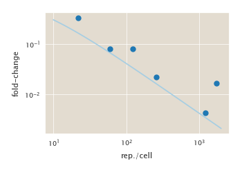
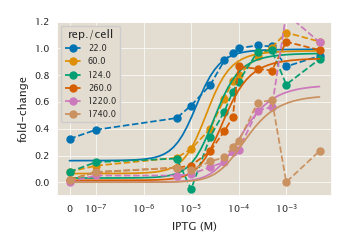

# 2019-10-30 Operator O2 IPTG titration

## Purpose
This experiment measured the fold-change in gene expression using fluorescence
reads from a flow cytometer.

## Equipment
Miltenyi Biotec MACSQuant flow cytometer (Bjorkman lab)

## Strain Information

| Plasmid | Genotype | Host Strain | Shorthand |
| :------ | :------- | ----------: | --------: |
| `none` |  `WT` | `HG105` | `auto` | `auto`|
| `none` | `galK<>O2+11-gfp-barcode ΔlacIZYA` | `HG105` | `delta`|
| `none` | `galK<>O2+11-gfp-barcode ΔlacZYA` | `HG104` | `R22`|
| `none` | `galK<>O2+11-gfp-barcode; ybcn<>3*1-RBS1147-lacI ΔlacIZYA` | `HG105` | `R60`|
| `none` | `galK<>O2+11-gfp-barcode; ybcn<>3*1-RBS446-lacI ΔlacIZYA` | `HG105` | `R124`|
| `none` | `galK<>O2+11-gfp-barcode; ybcn<>3*1-RBS1027-lacI ΔlacIZYA` | `HG105` | `R260`|
| `none` | `galK<>O2+11-gfp-barcode; ybcn<>3*1-RBS1-lacI ΔlacIZYA` | `HG105` | `R1220`|
| `none` | `galK<>O2+11-gfp-barcode; ybcn<>3*1-RBS1L-lacI ΔlacIZYA` | `HG105` | `R1740`|

## Titration Series
| Inducer | Concentration |
| :------ | ------------: |
| Isopropylthiogalactopyranoside (IPTG) | 0, 0.1, 5, 10, 25, 50, 75, 100, 250, 500, 1000, 5000  [µM] |

## Analysis Files

**LacI titration**

**Induction Profile**

## Experimental Protocol

### Cell Husbandry

1. Cells as described in "Strain Information" were grown to saturation
   overnight in 1mL of LB Miller + Kanamycin in a 2mL-deep 96 well plate
   (except for the `auto` strain that grew without antibiotic).

2. A 96 well plate with 500µL of M9 + 0.5% glucose and appropriate IPTG
   concentration was prepared via dilution from aliquoted 100X IPTG stocks.
   90µL of each  was transferred to a shallow 96 well plate for flow cytometry
   and kept at 4°C.

3. Cells were diluted 1:10 into 1mL of fresh M9 and thoroughly mixed. This was
   further diluted 1:100 into the M9 + IPTG medium.

4. The 96 well plate was placed in the 37°C incubation room and allowed to grow
   for 8 hours shaking at 225 RPM. This time is sufficient for cells to reach
   an  OD600nmof approximately 0.3

5.  Once 8 hours had passed, the cells were diluted 1:10 in to the chilled
    shallow 96 well plate filled with media and the appropriate concentration
    of IPTG. This plate was then taken for measurement via flow cytometry.

**Flow Cytometry**
1. Flow cytometer was cleaned with 1% bleach followed by a flush with washing
   buffer. If needed, the instrument was calibrated using the MACSQuant
   calibration beads.

2. The diluted 96 well plate was placed on a 4°C ice block for the duration of
   the measurement. 

2. Aliquots of 80 µL were withdrawn from each well, gently mixed, and analyzed
   for 20,000 individual events. The voltage settings of the PMTs were as
   follows:

| Wavelength | Channel | Sensor Voltage|
|:---|:---|---:|
| 488 nm | Forward Scatter (FSC) | 423 V|
| 488 nm   | Side Scatter (SSC) | 537 V|
| 488 nm | Intensity (B1 Filter, 525/50 nm) | 890 V|
| 488 nm | Trigger (debris threshold) | 24.5 V|

3. The measurement was periodically monitored and the buffer volumes were topped
off as necessary.

4. Once completed, the data was collected and transferred to the backup server.

## Notes

There was an error on the flow-cytometry plate preparation. Specifically the
plate was taken upside down and therefore cells with 0 µM IPTG were inoculated
in the opposite order in the 5000 µM IPTG lane. In the same way cells with 0.1
µM IPTG were inoculated upside down in the 1000 µM IPTG lane. The rest of the
lanes were normally inoculated.

On top of those cells, the usual cells were added, so we can expect a bimodal
distribition in expression that most likely will make these two data points
useless.
